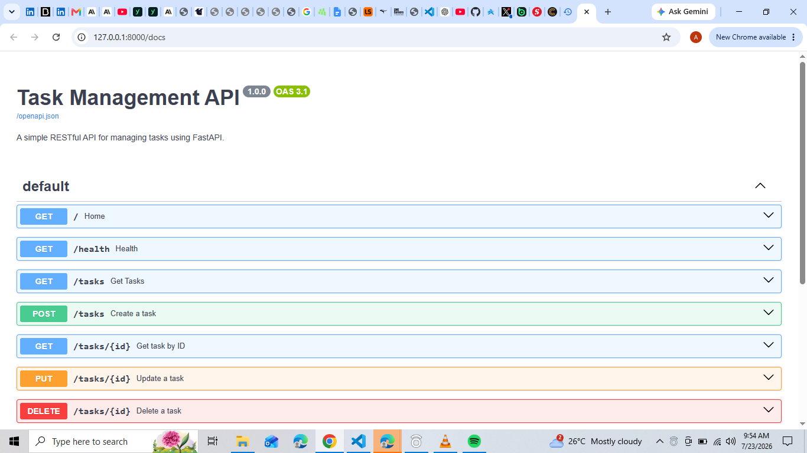

# Task Management API

## Project Overview

This project is a RESTful Task Management API built with **FastAPI**. It demonstrates the core CRUD (Create, Read, Update, Delete) operations through well-structured API endpoints. The project includes input validation using Pydantic, appropriate HTTP status codes, automatic Swagger UI documentation, and follows REST API best practices.

The API was developed as a backend learning project to strengthen skills in Python, FastAPI, HTTP, Git, and RESTful API design.

## Features

* Create new tasks
* Retrieve all tasks
* Retrieve a task by its ID
* Update a task's title and completion status
* Delete tasks
* Input validation with Pydantic
* Proper HTTP status codes (200, 201, 204, 400, 404)
* Interactive Swagger UI documentation
* Automatic OpenAPI documentation generated by FastAPI

## Technologies Used

* Python 3
* FastAPI
* Uvicorn
* Pydantic
* Git
* GitHub
* Swagger UI / OpenAPI

## Installation

1. Clone the repository:

```bash
git clone https://github.com/Jeffazi/MY-FIRST-API.git
```

2. Navigate to the project directory:

```bash
cd MY-FIRST-API
```

3. Create a virtual environment:

```bash
python -m venv venv
```

4. Activate the virtual environment:

**Windows**

```bash
venv\Scripts\activate
```

**macOS/Linux**

```bash
source venv/bin/activate
```

5. Install the required dependencies:

```bash
pip install -r requirements.txt
```

## Running the API

Start the development server with:

```bash
uvicorn main:app --reload
```

Once the server is running, open your browser and visit:

* API Root: http://localhost:8000
* Swagger UI: http://localhost:8000/docs

## API Endpoints

| Method | Endpoint      | Description                              |
| ------ | ------------- | ---------------------------------------- |
| GET    | `/`           | Returns basic information about the API. |
| GET    | `/health`     | Returns the API health status.           |
| GET    | `/tasks`      | Returns all tasks.                       |
| GET    | `/tasks/{id}` | Returns a specific task by its ID.       |
| POST   | `/tasks`      | Creates a new task.                      |
| PUT    | `/tasks/{id}` | Updates an existing task.                |
| DELETE | `/tasks/{id}` | Deletes a task by its ID.                |


## Swagger UI

The API includes automatically generated interactive documentation powered by FastAPI and OpenAPI.



## Example Request

```bash
curl -i http://localhost:8000/health
```

Example response:

```text
HTTP/1.1 200 OK
content-type: application/json

{"status":"ok"}
```

> **Note:** If you're using Windows PowerShell and `curl` invokes `Invoke-WebRequest`, use `curl.exe` instead.

## Future Improvements

This project can be extended with additional backend features, including:

* Store tasks in a database such as SQLite or PostgreSQL.
* Add user authentication and authorization.
* Implement pagination and filtering for tasks.
* Add automated unit and integration tests.
* Deploy the API to a cloud platform.

## Author

**Jeffazi**

GitHub: https://github.com/Jeffazi

 
